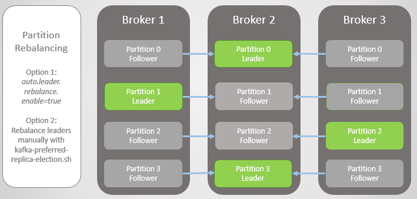

# Theory

* https://kafka.apache.org/documentation/
* https://kafka.apache.org/intro
* https://cwiki.apache.org/confluence/display/KAFKA/KIP-500%3A+Replace+ZooKeeper+with+a+Self-Managed+Metadata+Quorum

## Books and certs

* Book -> https://www.confluent.io/resources/kafka-the-definitive-guide/
* Cert -> https://cloud.contentraven.com/confluent/self-userpackage

## Dictionary

* Topic is an Entity in Kafka with a name
* Partition is where the message lives inside the topic
* Broker is an Apache Kafka instance (k8s POD or VM)
* Cluster is several brokers connected together

## Architecture


* **Topic** - Events are organized and durably stored in topics. Very simplified, a topic is similar to a folder in a
  filesystem, and the events are the files in that folder.
* **Partition** - Topics are partitioned, meaning a topic is spread over a number of "buckets" located on different
  Kafka
  brokers. This distributed placement of your data is very important for scalability because it allows client
  applications to both read and write the data from/to many brokers at the same time. When a new event is published to a
  topic, it is actually appended to one of the topic's partitions.

## API's

* Admin API - The Admin API supports managing and inspecting topics, brokers, acls, and other Kafka objects.
* Producer API - The Producer API allows applications to send streams of data to topics in the Kafka cluster.
* Consumer API - The Consumer API allows applications to read streams of data from topics in the Kafka cluster.
* Kafka Streams API - The Streams API allows transforming streams of data from input topics to output topics.
* Kafka Connect API - The Connect API allows implementing connectors that continually pull from some source data system
  into Kafka or push from Kafka into some sink data system.

## Partition

To receive messages in the same order, send messages to the same partition.

```
Using a hashing key partition, we can deliver messages with the same key in order, by sending it to the same partition.
Data within a partition will be stored in the order in which it is written. Therefore, data read from a partition will
be read in order for that partition with producer key.
```

## Consumer Offset

Consumer have three options to read:

* from-beginning
* latest
* specific offset

Consumer offsets behaves like a bookmark for the consumer to start
reading the messages from the point it left off.

## Consumer Groups

Consumer Groups are used for scalable message consumption.
Each different application will have a unique consumer group.


## Retention Policy

Determines how long the message is retained.
Configured using the property `log.retention.hours` in `server.properties` file.
Default retention period is 168 hours (7 days).

## Distributed streaming platform

Distributed systems are a collection of systems working together to
deliver a value.

Characteristics of Distributed System:

* Availability and Fault Tolerance
* Reliable Work Distribution
* Easily Scalable
* Handling Concurrency is fairly easy

Characteristics of Kafka as a Distributed System:

* Client requests are distributed between brokers
* Easy to scale by adding more brokers based on the need
* Handles data loss using Replication

## Replication

**Replication should be equal or less than the number of brokers that you have in the Kafka cluster**



When **Broker 1** is broken the new leader of partition 1 is a new broker e.g. **Broker 2**.

Check replication:

```shell
# Zookeeper
./kafka-topics.sh --bootstrap-server localhost:9092 --describe --topic <topic-name>
# Kraft
./kafka-topics.sh --zookeeper localhost:2181 --describe --topic <topic-name>
```

## In-Sync Replica(ISR)

* Represents the number of replica in sync with each other in the cluster
* Includes both leader and follower replica
* Recommended value is always greater than 1
* Ideal value is ISR == Replication Factor
* This can be controlled by `min.insync.replicas` property
* It can be set at the broker or topic level

## Producer Errors

https://www.conduktor.io/kafka/kafka-topic-configuration-min-insync-replicas

`min.insync.replicas` e.g.  `min.insync.replicas=2` this means that you have two replicas of the data that produced into
the topic (if only one producer is available, it generates an error)

`min.insync.replicas` default value is 1

```
In summary, when acks=all with a replication.factor=N and min.insync.replicas=M 
we can tolerate N-M brokers going down for topic availability purposes.
```